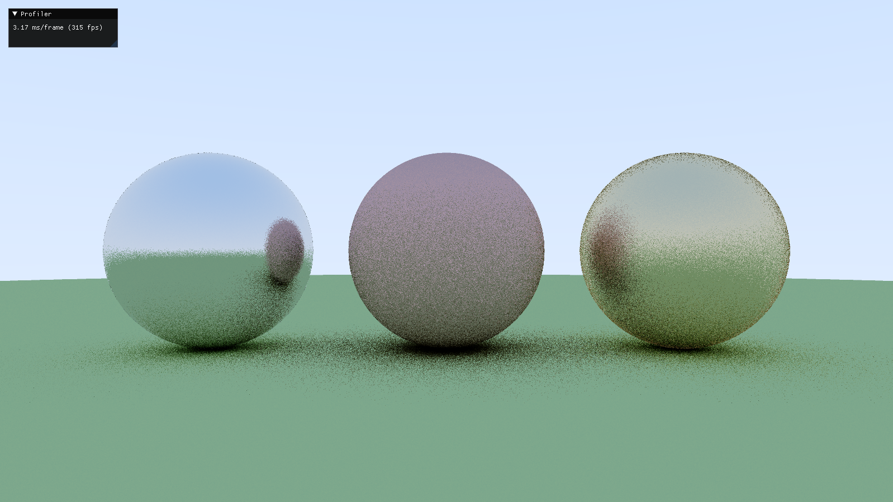
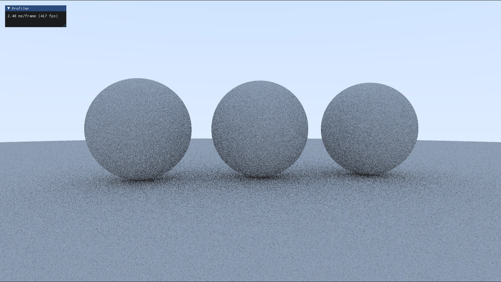
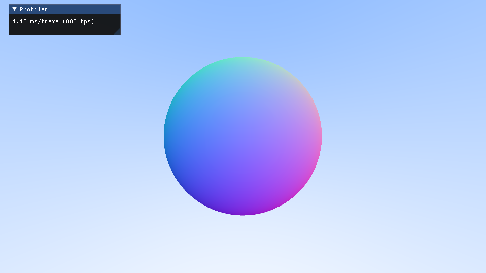
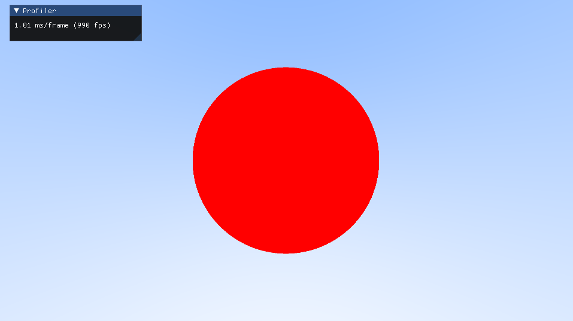

# shadersBasics
A playground to try out shaders.

## Prerequisites
* [CMake](https://cmake.org/download/)
* [Vulkan SDK](https://vulkan.lunarg.com/sdk/home) ([Installation guide](https://vulkan.lunarg.com/doc/sdk/latest/windows/getting_started.html))

### Optional
(Install these if you want to run `scripts/format.py` (runs clang-format on all source files))
* [Python](https://www.python.org/downloads/)
* [Clang](https://releases.llvm.org/download.html)


## Clone
Clone with `--recursive`
```
git clone --recursive https://github.com/amitshky/shadersBasics.git
```


## Build and Run
* Configure and build the project with `-DSHADERS_BASICS_USE_PRE_BUILT_LIB=OFF` to build the static libraries. This will also copy the libraries into the `binaries/` directory. You can then build with `-DSHADERS_BASICS_USE_PRE_BUILT_LIB=ON` to use those libraries while building instead of building them from scratch.
```
cmake -B build -S . -DSHADERS_BASICS_USE_PRE_BUILT_LIB=OFF
cmake --build build
```
* Then navigate to the output file and run it (run it from the root directory of the repo). For example,
```
./build/<path_to_executable>
```

OR (in VSCode)

* Start debugging (Press F5) (Currently configured for Clang with Ninja and MSVC for Windows) (NOTE: This will build with `-DSHADERS_BASICS_USE_PRE_BUILT_LIB=ON`)

OR (using bat scripts from `scripts` folder)

* Run them from the root directory of the repo (NOTE: This will build with `-DSHADERS_BASICS_USE_PRE_BUILT_LIB=ON`).
```
./scripts/config-clang-rel.bat
./scripts/build-clang.bat
./scripts/run-clang.bat
```

* To format all the source files according to `.clang-format` styles,
```
python format.py
```


## Usage
* Left-click and drag the mouse to move the camera
* Left-click and WASD to move the camera forward, left, back, and right respectively.
* Left-click and E and Q to move the camera up and down.
* R to reset the camera
* Ctrl+Q to close the window


## Screenshots

Ray-traced spheres (with metal and diffused materials) (checkout `c94224835f64ca94fccf183542887896ab54a772`)\


Ray-traced spheres (with diffused lighting) (checkout `e1d5619642686fc14dac398194aa65350d3244cc`)\


Ray-traced sphere (showing normal vectors) (checkout `1a06bd90981ac5c1deb4b24de918bd681daf4069`)\


Ray-traced sphere (checkout `5574e973685c9504c7081f52b86a2e9d48fac18a`)\


checkout `1e78f83db5289800e632ff72ecaf2ef0daca815c` (ref: [An introduction to Shader Art Coding - kishimisu](https://youtu.be/f4s1h2YETNY))\


checkout `735f770a3fcfca2b98da81e2a32400ecbdd55bd2`\


## References
* [Vulkan tutorial](https://vulkan-tutorial.com/)
* [Vulkan Specification](https://registry.khronos.org/vulkan/specs/1.3-extensions/pdf/vkspec.pdf)
* [learnopengl.com](https://learnopengl.com/)
* [Scratchapixel](https://www.scratchapixel.com)
* [Sascha Willems examples](https://github.com/SaschaWillems/Vulkan)
* [vkguide.dev](https://vkguide.dev/)
* [An introduction to Shader Art Coding - kishimisu](https://youtu.be/f4s1h2YETNY)
* [Intro to Graphics - Cem Yuksel](https://www.youtube.com/playlist?list=PLplnkTzzqsZTfYh4UbhLGpI5kGd5oW_Hh)
* [Ray Tracing in One Weekend - Peter Shirley](https://raytracing.github.io/books/RayTracingInOneWeekend.html)
* [Ray Tracing Series - The Cherno](https://www.youtube.com/playlist?list=PLlrATfBNZ98edc5GshdBtREv5asFW3yXl)
